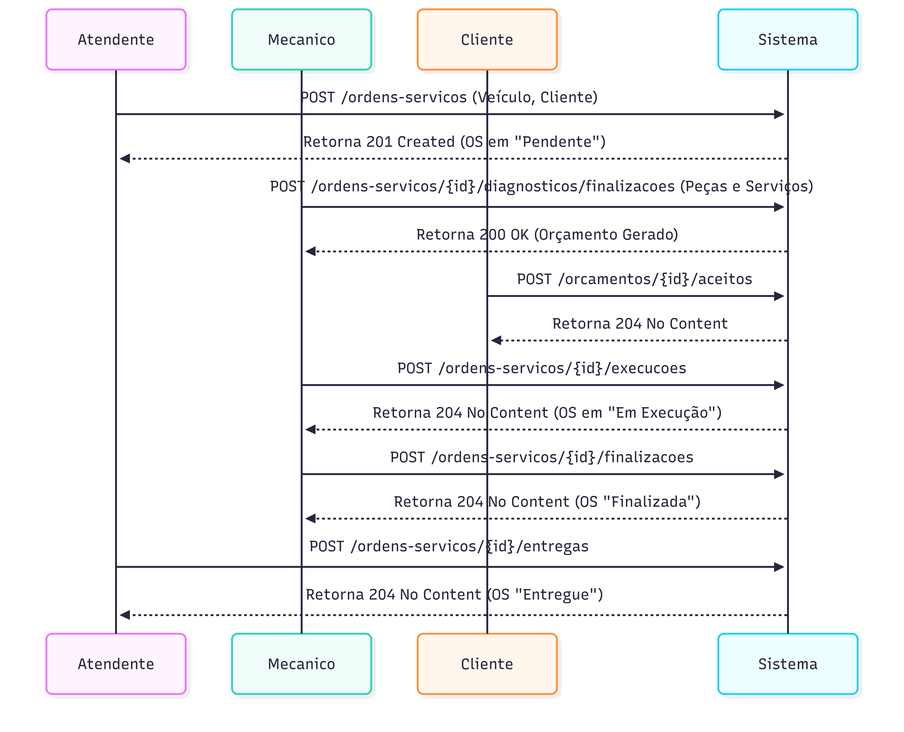
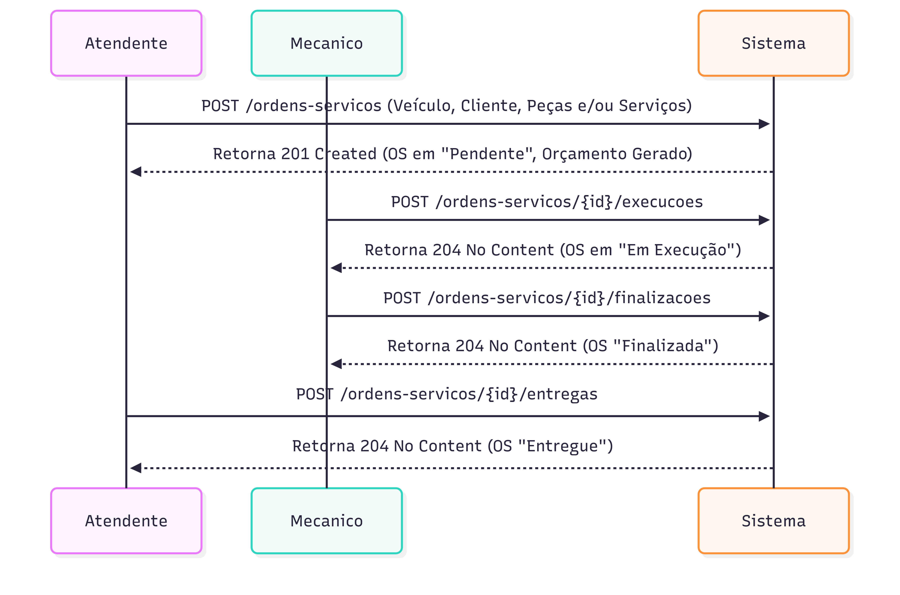

# Fluxo de Ordem de Serviço

Este documento detalha os dois fluxos principais de uma Ordem de Serviço (OS) na aplicação: a OS com diagnóstico e a OS direta, onde os serviços e peças já são conhecidos no momento da criação.

## Fluxo 1: Ordem de Serviço com Diagnóstico

Este é o fluxo padrão, onde o veículo passa por uma análise antes da definição dos serviços e peças.

### Explicação do Fluxo 1:

1.  **Abertura da Ordem de Serviço:**
    *   O **Atendente** realiza uma requisição `POST` para o endpoint `/ordens-servicos`, enviando os dados do veículo e do cliente.
    *   O **Sistema** cria a Ordem de Serviço com o status inicial de **"Pendente"** e retorna o status `201 Created`.

2.  **Diagnóstico e Orçamento:**
    *   O **Mecânico** realiza o diagnóstico do veículo e, em seguida, envia uma requisição `POST` para `/ordens-servicos/{id}/diagnosticos/finalizacoes`, informando as peças e serviços necessários.
    *   O **Sistema** processa a requisição, gera o orçamento e retorna o status `200 OK`.

3.  **Aprovação do Orçamento:**
    *   O **Cliente** aprova o orçamento através de uma requisição `POST` para `/orcamentos/{id}/aceitos`.
    *   O **Sistema** atualiza o status do orçamento para "Aprovado" e retorna `204 No Content`.

4.  **Execução do Serviço:**
    *   Com o orçamento aprovado, o **Mecânico** inicia a execução dos serviços e sinaliza isso ao sistema com uma requisição `POST` para `/ordens-servicos/{id}/execucoes`.
    *   O **Sistema** atualiza o status da OS para **"Em Execução"** e retorna `204 No Content`.

5.  **Finalização do Serviço:**
    *   Após a conclusão dos trabalhos, o **Mecânico** envia uma requisição `POST` para `/ordens-servicos/{id}/finalizacoes`.
    *   O **Sistema** atualiza o status da OS para **"Finalizada"** e retorna `204 No Content`.

6.  **Entrega do Veículo:**
    *   O **Atendente** realiza a entrega do veículo ao cliente e registra este evento no sistema através de uma requisição `POST` para `/ordens-servicos/{id}/entregas`.
    *   O **Sistema** atualiza o status da OS para **"Entregue"** e retorna `204 No Content`.

## Fluxo 2: Ordem de Serviço Direta

Este fluxo é utilizado quando os serviços e/ou peças já são conhecidos no momento da abertura da OS, não necessitando de um diagnóstico prévio.

### Explicação do Fluxo 2:

1.  **Abertura da Ordem de Serviço Direta:**
    *   O **Atendente** realiza uma requisição `POST` para `/ordens-servicos`, enviando os dados do veículo, do cliente e também a lista de peças e/ou serviços já definidos.
    *   O **Sistema** cria a OS com o status **"Pendente"** e, simultaneamente, já gera o orçamento, uma vez que os itens são conhecidos. A resposta é `201 Created`.

2.  **Aprovação do Orçamento (implícita):**
    *   Neste fluxo, a aprovação do orçamento pode ser considerada implícita, uma vez que o cliente já concordou com os serviços e peças no momento da abertura da OS. O sistema já pode seguir para a execução.

3.  **Execução do Serviço:**
    *   O **Mecânico** inicia a execução dos serviços e sinaliza isso ao sistema com uma requisição `POST` para `/ordens-servicos/{id}/execucoes`.
    *   O **Sistema** atualiza o status da OS para **"Em Execução"** e retorna `204 No Content`.

4.  **Finalização do Serviço:**
    *   Após a conclusão dos trabalhos, o **Mecânico** envia uma requisição `POST` para `/ordens-servicos/{id}/finalizacoes`.
    *   O **Sistema** atualiza o status da OS para **"Finalizada"** e retorna `204 No Content`.

5.  **Entrega do Veículo:**
    *   O **Atendente** realiza a entrega do veículo ao cliente e registra este evento no sistema através de uma requisição `POST` para `/ordens-servicos/{id}/entregas`.
    *   O **Sistema** atualiza o status da OS para **"Entregue"** e retorna `204 No Content`.